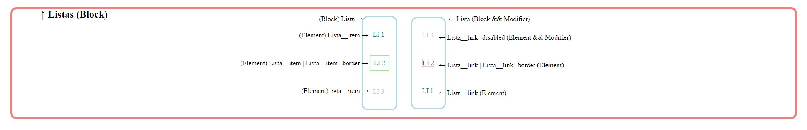

# Estudo-CSS

##### Estudo de BEM (Block-Element-Modifier)

###### Básico

A tela acima mostra os blocos os elementos e os modificadores quando utilizamos BEM para escrever o código de CSS. Essa tela foi feita usando CSS puro escrito utilizando a metodologia BEM. 

###### TelaInstagram

O projeto acima é uma refatoração do curso da DIO de recriação da página inicial do instagram. Após o refatoramento esse projeto usa a metodologia BEM para organizar as classes da tela. Além disso o projeto tenta trazer o mínimo de elementos não semânticos para o código (única div utilizada é para estilização).